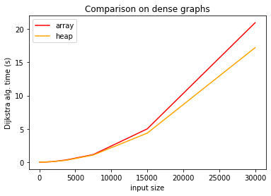
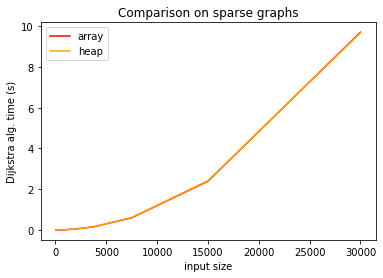

## Weighted Graphs: Homework (30/4/2020)

The required codes are inside the folder `Ad_dijkstra`, by typing `make` inside the folder will produce an executable `dijkstra_test` which tests both the correctness and the performance of the codes.

### 1.

The array-based version of the Dijkstra's algorithm is implemented by the function `Dijkstra_Aq` (`src/dijkstra.c`).

### 2.

The heap-based version of the Dijkstra's algorithm is implemented by the function `Dijkstra_minheap` (`src/dijkstra.c`).

### 3.

I tested the implementation of these functions in both dense and sparse graphs, varying the size of them several time.

The following plots report the execution time:

If we consider a graph $G=(V,E)$, then the asymptotic complexity of Dijkstra's algorithm is:

* $\Theta(|V|^2+|E|)$ for the array-based implementation;

* $O((|V|+|E|)\cdot log(|V|))$ for the binary-heap-based implementation.

The result I obtained is somehow consistent with the theoretical results: indeed in the case of dense graphs the heap-based implementation runs faster than the array-based one (the difference becomes more significant increasing the size of the graph), while in the case of sparse graphs, where $|V|>>|E|$, the two complexities are almost equivalent. 
