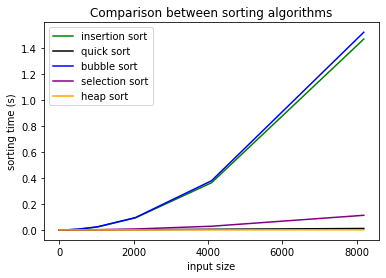
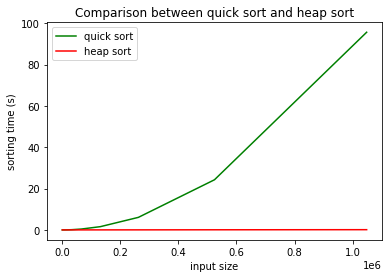
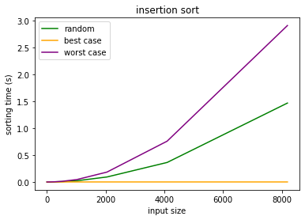
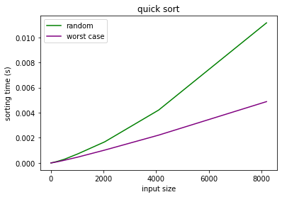

## Sorting: homework (31/03/2020)

#### 1.

The required code has been implemented inside the folder `AD_sorting`, which was cloned from the provided repository ([sorting git repo](https://github.com/albertocasagrande/AD_sorting)). Typing `make` will produce an executable `test_sorting` which tests the correctness and the execution time of the sorting algorithms implemented. For the sake of practicality, in order to easily compile the `heapsort` algorithm, a copy of the interface and of the implementation of the binary heap has been added (copy-pasted from one the previous homeworks).

#### 2.

After having implemented the code required by the previous exercise, thanks to the provided code testing the execution time for each of the sorting algorithms (`main.c`), the following curves relating the input size to the execution-time have been produced (using `matplotlib.pyplot` in Python 3).

The following plot shows the behaviour of all the sorting algorithms for a random array.
Theoretically we have that the complexity of those algorithms are (with $n := input\_size$):
 * *insertion sort*: $O(n^2)$ for the worst case, $\Omega(n)$ for the best case (hence we expect something in between for the random case);
 * *quick sort*: $\Theta(n\log(n))$ for the average case ($O(n^2)$ in the worst case, $\Omega(n\log(n))$ for the best case);
 * *bubble sort*: $\Theta(n^2)$;
 * *selection sort*: $\Theta(n^2)$;
 * *heap sort*: $O(n\log(n))$.

Experimental results are coherent with the theoretical results stated above. Selection sort seem to perform particularly well, but it could be the case that the input size is not big enough to show its asymptotic behaviour.

From the previous plot, it seems that quick sort and heap sort are comparable in terms of performances, however, keeping increasing the input size, we can see how heap sort outperforms quick sort.

The following two plots show the different behaviour of insertion sort and quick sort in the best (only insertion sort actually), the worst and the random case (again theoretically results are confirmed by experimental results):

#### 3.

Consider heapsort, it has $O(n\log(n))$ complexity for both the best and the worst case. Indeed the height of a complete binary tree containing n elements is $\log(n)$. To fully heapify an element whose subtree are already max-heaps (and this happens when extracting the minimum in a max-heap), we need to keep comparing the element with both its children until we reach a point where both children are smaller than it (we are pushing down the comparisons). So in the worst case scenario, we would have to move an element from the root to the leaf node, making a number $\propto \log(n)$ of comparisons and swaps, for every step (they are $\sim n$ in total) of the sorting algorithm, hence we get $O(n\log(n))$ time complexity to extract the minimum. Building a max heap costs $O(n)$, but it is executed once, before starting the sorting step, hence it does not change the complexity of the overall algorithm (its complexity is summed to the one of extract min).

If all keys in input are the same, every time we remove an element from the root, the item replacing it won't have to be swapped with any other element. So that each remove takes $\Theta(1)$ time (only the first swap). In this case the overall complexity is $\Theta(n)$, i.e. only the cost of building the heap.

Hence we get:
 (a) verified in the case of an array made on n identical elements;
 (b) same as (a), since $\Theta(n) = \Omega(n)\cap O(n)$;
 (c) $O(n\log(n))$, as discussed above.

 Consider now quick sort, the complexity of this algorithm crucially depends on the complexity of the partition procedure. As examined during the lectures, the best case for the partition procedure happens when at each recursive step the partition is balanced, and it is linear $\Theta(n)$, corresponding to the best case scenario of the quick sort algorithm $\Theta(n\log(n))$. While the worst case happens when we apply quick sort to an already sorted array, which is -regardless of the partition procedure- $O(n^2)$.

 Hence we get:
 (d) in the worst case we have $O(n^2)\subseteq O(n^3)$;
 (e) see analysis before.

 Consider now bubble sort, it substantially linear scans the whole array, comparing adjacent elements and swaps them if they are in the wrong order. It has a worst case complexity of $\Theta(n^2)$. However bubble sort has the ability (by construction) to detect if an array is already sorted. When this happens, namely we are in the best case scenario, complexity is $\Theta(n)$.

 Hence we get:
 (f) since $\Theta(n) = \Omega(n)\cap O(n)$, this happens in the best case scenario;
 (g) see analysis before.

#### 4.

We can solve this equation with a recursion tree. We can observe that each level of the tree has 3 times more node than the level above (hence number of nodes at level $i$ is $3^i$).

If we choose $c\cdot n^{\frac{3}{2}}$, for some $c>0$, as representative of $\Theta(n^{\frac{3}{2}})$, then each node at depth $i$ has a cost of $c\cdot (\frac{n}{4^i})^{\frac{3}{2}}$.

Summing up we get that the total cost over all nodes at depth $i$ is $3^i\cdot c\cdot (\frac{n}{4^i})^{\frac{3}{2}} = (\frac{3}{8})^i\cdot c\cdot n^{\frac{3}{2}}$.

Since the subproblem size for a node at depth $i$ is $(\frac{n}{4})^i$ we hit the boundary condition $n=32$ when $\frac{n}{4^i} = 32 \leftrightarrow n = 32\cdot 4^i = 2^{5+2i}\leftrightarrow i = \frac{log_2n-5}{2}$.

Thus the tree has $\frac{log_2n-5}{2} +1 = \frac{log_2n-3}{2}$ levels.

The number of nodes at the last level is $3^{\frac{log_2n-3}{2}} = n^{\frac{log_23}{2}}\cdot 3^{-\frac{3}{2}}$, so the cost of last level is $\Theta(n^{\frac{log_23}{2}}\cdot 3^{-\frac{3}{2}}) = \Theta(n^{\frac{log_23}{2}})$.

Hence $$T(n) = \sum_{i=0}^{\frac{log_23-3}{2}-1}(\frac{3}{8})^i\cdot c\cdot n^{\frac{3}{2}} + \Theta(n^{\frac{log_23}{2}})<\\< \sum_{i=0}^{\infty}(\frac{3}{8})^i\cdot c\cdot n^{\frac{3}{2}} + \Theta(n^{\frac{log_23}{2}}) =\\= \frac{1}{1-\frac{3}{8}}c\cdot n^{\frac{3}{2}} + \Theta(n^{\frac{log_23}{2}}) \in O(n^{\frac{3}{2}})$$.  
