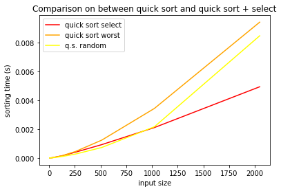

## Sorting: homework (2/04/2020)

#### 1.

In order to generalize the `SELECT` algorithm to deal also with repeated values, my idea was to partition the input array in three parts:

* $1^{st}$ part containing all elements smaller than the pivot;

* $2^{nd}$ part containing all elements equal to the pivot;

* $3^{rd}$ part containing all elements bigger than the pivot.

The pseudo-code of this partition procedure is:

```
def TRIPARTITION(A, i, j, p):
  swap(A,i,p)
  (p,i) <-- (i,i+1)
  s = 0 //var to count the number of elements equal to the pivot

  while i<=j:
    if A[i]>A[p]:
      swap(A,i,j)
      j <-- j - 1
    else if A[i]<A[p]:
      swap(A,i,p)
      p <-- i
      i <-- i + 1
    else if A[i] == A[p]
      p <-- i
      i <-- i + 1
      s <-- s + 1  
    endif
  endwhile

  swap(A, p, j)
  k = (j-s, j) //pair of indexes

  return k
enddef      
```

The complexity of each `if` block is $\Theta(1)$ (indeed they are just swaps and/or variable assignments). The `while` loop is repeated $\Theta(j-i)$ times. Hence this partition procedure has the same complexity of the partition procedure used in the situation where repetitions were not allowed.

Since all the other parts of the algorithm are left unchanged, the complexity of the SELECT algorithm remains $O(n)$.

#### 2.

The complexity of QUICK_SORT critically depends on the partition procedure. Indeed in the worst case (meaning when $|S|=0$ or $|G|=0$), as we discussed in class, this complexity is $\Theta(n^2)$.

By choosing the pivot with the `median_of_medians` algorithm (and then partitioning around this pivot), we avoid (except that in the case where all elements of the array are equal) that $|S|=0$ or $|G|=0$, and so we resort to the QUICK_SORT average case of $\Theta(n\cdot \log(n))$.

The following plots show the relation between the input size and the execution time of the two variants of QUICK_SORT, in the case of an sorted array:



#### 3. Ex. 9.3-1 in *Introduction to algorithmic design*

If we divide the elements of the input array into chunks of 7, so that we have $\big\lceil \frac{n}{7} \big\rceil$ chunks, then we can say that number of elements greater than the median of medians would be $4\cdot \big(\big\lceil \frac{1}{2}\big\lceil \frac{n}{7} \big\rceil\big\rceil-2\big)\geq \frac{2n}{7}-8$ so that the recursive equation for the complexity of the algorithm becomes $T(n) = T(\lceil \frac{n}{7} \rceil) + T(\frac{5n}{7}+8) + O(n)$.

We can solve this by substitution. We guess $T(n)<cn$ and we choose $c'n$ for some $c'>0$ as representative for $O(n)$, then (if $n>7$),  $T(n) = T(\lceil \frac{n}{7} \rceil) + T(\frac{5n}{7}+8) + c'n \leq c \big\lceil \frac{n}{7} \big\rceil + c\cdot(\frac{5n}{7}+8) + c'n\leq c (\frac{n}{7} + 1) + c\cdot(\frac{5n}{7}+8) + c'n \leq c(\frac{6n}{7}) +c\cdot 9 + c'n$. We have that $\frac{5}{7}n + 8 < n \leftrightarrow n>28$, moreover if $c\geq c'$, then $T(n)\leq \frac{6}{7}cn+\frac{1}{28}cn \leq \frac{6}{7}cn + c\cdot 9 \leq cn$ when $n\geq 63$.

Hence we have shown that $T(n)\in O(n)$.

If instead we divide the elements of the input array into chunks of 3, so that we have $\big\lceil \frac{n}{3} \big\rceil$ chunks, then the number of elements greater than the median of medians would be $2\cdot \big(\big\lceil \frac{1}{2}\big\lceil \frac{n}{3} \big\rceil\big\rceil-2\big)\geq \frac{2n}{6}-4$, so  that the recursive equation for the complexity of the algorithm becomes $T(n) = T(\lceil \frac{n}{3} \rceil) + T(\frac{4n}{6}+4) + O(n)$.

We can again solve this by substitution. We guess $T(n)>cn$ for some $c>0$ and we choose $c'n$ for some $c'>0$ as representative for $O(n)$, then $T(n) = T(\lceil \frac{n}{3} \rceil) + T(\frac{4n}{6}+4) + c'n \geq c \big\lceil \frac{n}{3} \big\rceil + c\cdot(\frac{4n}{6}+4) + c'n\geq c (\frac{n}{3}) + c\cdot(\frac{4n}{6}+4) + c'n \geq cn +c\cdot 4 + c'n\geq cn+ c\cdot 4$.  Therefore we have that it grows more than linearly.

#### 4. Ex. 9.3-5 in *Introduction to algorithmic design*

The pseudo-code for such an algorithm could be the following:

```
SELECT(A, l=1, r=|A|, i)
  if(l == r)
    return A[l];
  m<-MEDIAN(A, l, r) //O(n), black-box routine
  p<-PARTITON(A, m) //O(n), partition around the median
  k = p - l + 1 //length of the first half of the array
  if i == k
    return A[q]
  if i < k //recur in the first half of the array
    return SELECT(A, l, p-1, i)
  //else recur on the second half of the array
  return SELECT(A, p+1, r, i-k)
  endif
enddef
```
So the recursive equation for the complexity of this algorithm is $T(n) = T(\frac{n}{2})+ O(n)\in O(n)$.


#### 5.

The recursive equations $T_1(n)$ and $T_2(n)$ were actually solved during lectures. I report here the proposed solution.

##### 5.1

$T_1(n) = 2\cdot T_1(\frac{n}{2}) + O(n)$

**Recursion tree solution**:

Each level has 2 times more nodes than the level above. So the number of nodes at level $i$ is $2^i$ and the height of the tree is $\log_2(n)$.

Hence each node at depth $i$ has a cost of $c(\frac{n}{2^i})$, choosing $c\cdot n$ as representative for $O(n)$.

So the total cost at level $i$ is given by $C_i(n)\leq 2^i \frac{n}{2^i} c = c\cdot n$.

The overall cost is thus given by $T_1(n)\leq \sum_{i=0}^{log_2(n)}2^i c \frac{n}{2^i} = cn\sum_{i=0}^{log_2n}1 = \leq cnlog_2n \in O(n\cdot log_2n)$

**Substitution method solution**:

We guess $T_1(n)\in O(n\cdot log_2n)$.

We select $c\cdot nlog_2n$ as representative for $O(n\cdot log_2n)$ and $c'n$ as representative for $O(n)$.

We start assuming that our hypothesis holds $\forall m<n$, namely $T_1(m)\leq cmlog_2m \ \ \forall m<n$, thus:

$T_1(n) = 2T_1(\frac{n}{2}) + c'n \leq 2c\frac{n}{2}log(\frac{n}{2})+c'n\leq cnlogn - cnlog2 + c'n \leq cnlogn$ iff $c'n-cnlog2 \leq 0 \leftrightarrow c\geq c'$.

Then we can conclude that, by selecting an opportune $c$, $T_1(n)\in O(nlogn)$.

##### 5.2

$T_2(n) = T_2(\lceil \frac{n}{2} \rceil) + T_2(\lfloor \frac{n}{2} \rfloor) + \Theta(1)$

**Recursion tree solution**:

We can observe that in the recursion tree built out of this formula, the leftmost branch involves only ceiling operation, while the rightmost branch involves only floor operations, and that each level has 2 times more nodes than the level above.

For what concerns the leftmost branch, we can say that the length of this branch is $\leq log_2(2n)$, since $\forall n$, there is a power of 2 in $[n,2n]$.

For what concerns the rightmost branch, we can say that the length of this branch is $\geq log_2(\frac{n}{2})$, since we are searching for the power of 2 just before $n$.

Hence, if we choose $c$ as representative of $\Theta(1)$, we have that, until we reach the last complete level of the tree, which is at height $\geq log_2(\frac{n}{2})$, each node at level $i$ costs $c$, and the number of nodes at level $i$ is $2^i$. Thus:

$T_2(n)\geq \sum_{i=0}^{log_2(\frac{n}{2})}c2^i\geq c\frac{2^{log_2(\frac{n}{2})+1}-1}{2-1}\geq c2^{log_2(n)-log_22+1-1}\geq cn - c\in \Omega(n)$

which gives us a lower bound for the complexity of $T_2(n)$.

Then we can consider the leftmost branch of the tree, having:

$T_2(n)\leq \sum_{i=0}^{log_2(2n)}c2^i\leq c \frac{2^{log_2(2n)+1}-1}{2-1} = 4cn-c\in O(n)$.

Thus, putting all together, $T_2(n)\in \Theta(n)$.

**Substitution method solution**:

We first guess $T_2(n)\in O(n)$

We select $c\cdot n$ as representative for $O(n)$ and 1 as representative for $\Theta(1)$, and we inductively assume that $T_2(m)\leq cm \ \ \forall m<n$. Thus:

$T_2(n) = T_2(\lceil \frac{n}{2} \rceil) + T_2(\lfloor \frac{n}{2} \rfloor) + 1 \leq c(\lceil \frac{n}{2} \rceil) + c(\lfloor \frac{n}{2} \rfloor) + 1 \leq cn+1$

But then we are stuck, since our goal was to prove $T_2(n)\leq c\cdot n$. So we try to change the representatives, and choose $c\cdot n- d$ as representative for $O(n)$.

$T_2(n)\leq c(\lceil \frac{n}{2} \rceil) -d + c(\lfloor \frac{n}{2} \rfloor) -d + 1\\\leq cn-2d+1\\\leq cn-d \leftrightarrow 1-d\leq 0 \leftrightarrow d\geq 1$.

Hence $T_2(n)\in O(n)$.

Now we guess $T_2(n)\in \Omega(n)$, and we choose $c\cdot n$ as representative for $\Omega(n)$ and again 1 as representative for $\Theta(1)$. We inductively assume $T_2(m)\geq cm \ \ \forall m<n$.

$T_2(n)\geq c(\lceil \frac{n}{2} \rceil) + c(\lfloor \frac{n}{2} \rfloor) + 1\geq cn+1\geq cn$ $\forall c\geq 0$.

So we have proved that $T_2(n)\in \Omega(n)$ hence $T_2(n)\in \Theta(n)$.

##### 5.3

$T_3(n) = 3T_3(\frac{n}{2}) + O(n)$

**Recursion tree solution**:

Each level has 3 times more nodes than the level above, so the number of nodes at level $i$ is $3^i$. Each node at depth $i$ has a cost of $c(\frac{n}{2^i})$.

So the total cost over all nodes at depth $i$ is $3^ic(\frac{n}{2^i}) = c(\frac{3}{2})^in$, and the tree has depth $log_2(n)$. Thus:

$T_3(n) \leq \sum_{i=0}^{log_2(n)}(\frac{3}{2})^i cn = cn \frac{(\frac{3}{2})^{log_2(n)}-1}{\frac{3}{2}-1} = cn(3n^{log_23-1}-1) \in O(n^{log_23})$

**Substitution method solution**:

We guess $T_3(n)\in O(n^{log_23})$.

We take $cn^{log_23}$ as representative for $O(n^{log_23})$ and $c'n$ as representative for  $O(n)$, and we assume that $T_3(m)\leq cm^{log_23} \ \ \forall m<n$. Hence:

$T_3(n)\leq 3c\frac{n^{log_23}}{2}+ c'n = cn^{log_23} + c'n$ but we stuck.

Hence we change the representative for $O(n^log_23)$, taking $cn^log_23 - dn$, namely subtracting a lower order term from the previous one. Thus:

$$T_3(n)\leq 3(c\frac{n^{log_23}}{3}-d\frac{n}{2}) + c'n =\\= cn^{log_23}-\frac{3}{2}dn + c'n =\\= cn^{log_23} -n (\frac{3}{2}d -c')\leq\\\leq cn^{log_23} -dn \leftrightarrow d\leq 2c'$$

Hence $T_3(n)\in O(n^{log_23})$.

##### 5.4

$T_4(n) = 7T_4(\frac{n}{2})+ \Theta(n^2)$

**Recursion tree solution**:

We have that the subproblem size for a node at depth $i$ is $\frac{n}{2^i}$, thus the tree has depth $log_2n$ and the total cost at depth $i$ is $7^ic(\frac{n}{2^i})^2 = c(\frac{7}{4})^in^2$ being $cn$ a representative for $\Theta(n^2)$. Hence:

$$T_4(n) \leq \sum_{i=0}^{log_2n}\big(\frac{7}{4}\big)^i cn^2 = cn^2\bigg(\frac{(\frac{7}{4})^{log_2n+1}-1}{\frac{7}{4}-1}\bigg) =\\= cn^2\frac{4}{3}\bigg(\frac{7}{4}n^{log_27-log_24}-1\bigg) =\\= cn^2\frac{4}{3}\bigg(\frac{7}{4}n^{log_27-2}-1\bigg)\in O(n^{log_27})$$

**Substitution method solution**:

We guess $T_4(n)\in O(n^{log_27})$.

We choose $cn^{log_27}-dn^2$ as representative for $O(n^{log_27})$ (if we don't subtract a lower order term we get stuck, as in the previous cases) and $c'n^2$ as representative for $\Theta(n^2)$ and we assume $T_4(m)\leq cm^{log_27}-dm^2 \ \ \forall m<n$.

$$T_4(n)\leq 7c((\frac{n}{2})^{log_27}-d\frac{n^2}{2}) +c'n^2 =\\= cn^{log_27}-\frac{7}{2}dn^2+c'n^2 =\\= cn^{log_27}-n^2(\frac{7}{2}d-c')\leq cn^{log_27}-dn^2 \leftrightarrow d\leq \frac{2}{5}c'$$.

Thus $T_4(n)\in O(n^{log_27})$.
